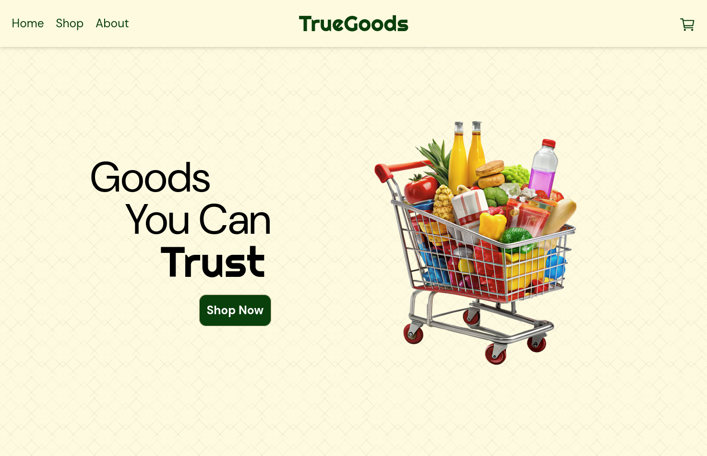
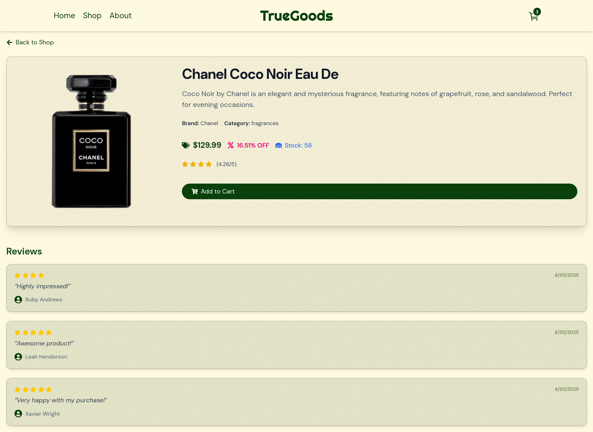
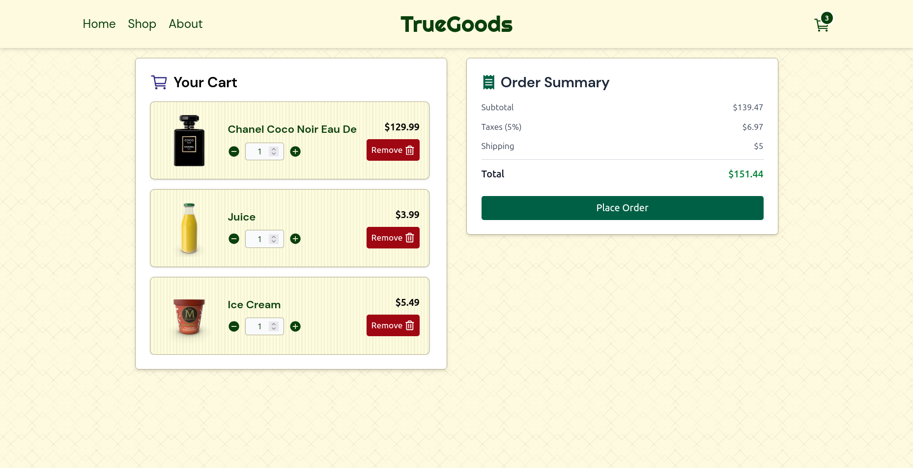
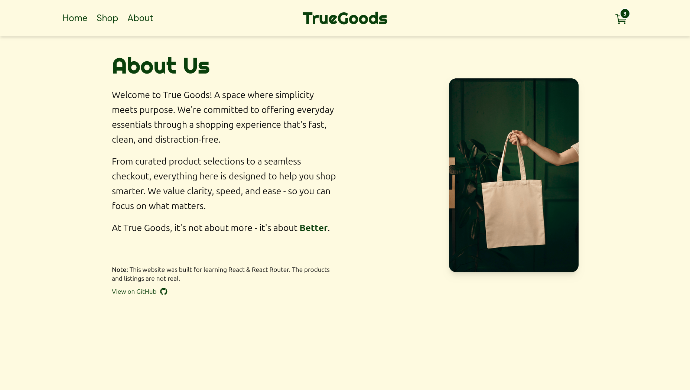

# 🛍️ TrueGoods

**TrueGoods** is a responsive e-commerce frontend built with **React**, **React Router DOM**, and **Tailwind CSS**, featuring dynamic routing, API-integrated product listings, and interactive cart functionality — all structured with reusable components.

🔗 **Live Site:** [https://true-goods.vercel.app](https://true-goods.vercel.app)

## ✨ Features

- Home page with welcome section and CTA
- Shop page with product listing from API
- Product details page with user reviews
- Shopping cart with update and delete functionality
- About Us page with store information
- Toast notifications for user actions
- Responsive design for desktop and tablet screens

## 🖼️ Screenshots

### 🏠 Home Page



### 🛍️ Shop Page


### 🔎 Product Details Page



### 🛒 Cart Page



### ℹ️ About Us Page



## 🧰 Tech Stack

- React
- React Router DOM
- Tailwind CSS
- React Toastify
- DummyJSON API (for products)

## 📁 Project Structure

```
truegoods/
├── src/
│   ├── api/
│   │   └── getProducts.jsx
│   ├── components/
│   │   ├── Navbar.jsx
│   │   ├── OrderProductCard.jsx
│   │   ├── PaymentSuccessToast.jsx
│   │   ├── ProductCard.jsx
│   │   └── Searchbar.jsx
│   ├── pages/
│   │   ├── AboutPage.jsx
│   │   ├── CheckoutPage.jsx
│   │   ├── ErrorPage.jsx
│   │   ├── HomePage.jsx
│   │   ├── ProductPage.jsx
│   │   └── ShopPage.jsx
│   ├── App.jsx
│   ├── routes.jsx
│   ├── main.jsx
│   └── index.css
├── index.html
├── package.json
├── vite.config.js
├── eslint.config.js
└── README.md
```

## 🚀 Getting Started

Follow these steps to run the project locally:

### 1. Clone the repository

```bash
git clone https://github.com/Fa1sall/TrueGoods.git
cd TrueGoods
```

### 2. Install dependencies

```bash
npm install
```

### 3. Start the development server

```bash
npm run dev
```

## 📄 Attributions

- **Product API:** [DummyJSON](https://dummyjson.com/products)
- **Vector Illustrations:** Images used in the site are sourced from [PNGTree](https://pngtree.com/), which provides free and premium vector graphics.
- **Background Patterns:** Some background patterns are designed using [PatternsCraft](https://patterncraft.fun/), a free pattern generator tool.
